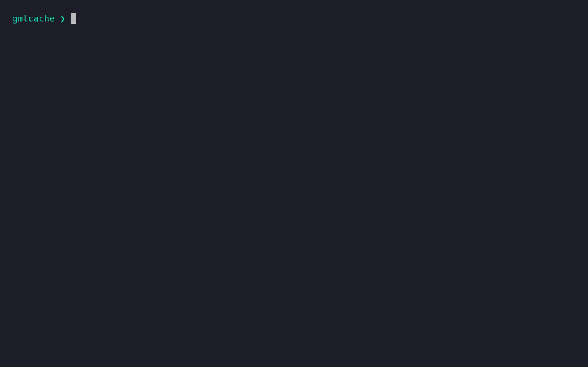
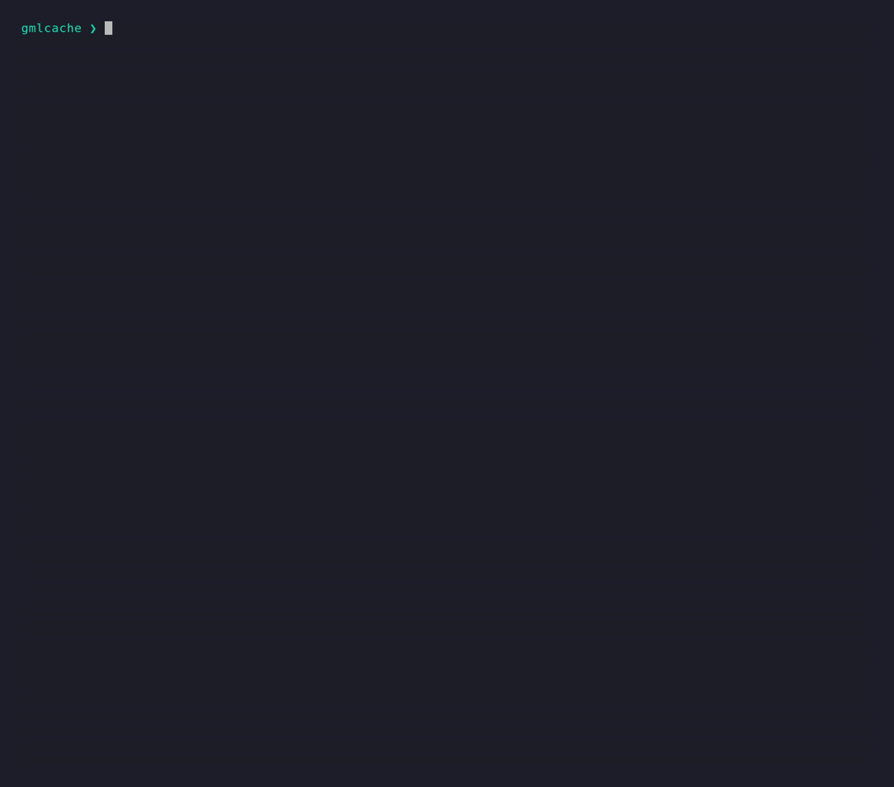
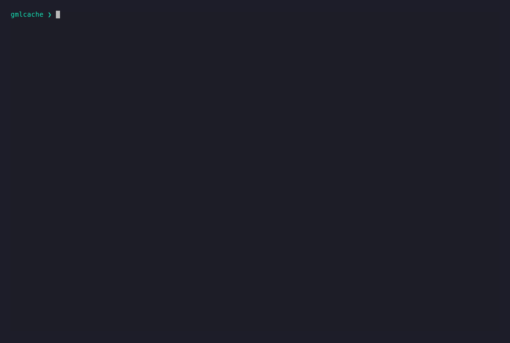

<div align="center">

<br>

<picture>
  <source media="(prefers-color-scheme: dark)" srcset="docs/images/gmlcache-lockup-dark.svg">
  
</picture>

#### Detached ML Execution Cache

**Run**, **record**, and **replay** detached ML workloads — exact, content-addressed, and inspectable. Record a real client (or API) call once; replay it forever by its content key — offline and byte-for-byte.

<br>

[](LICENSE)
[](docs/ROADMAP.md)
[](docs/concepts/adapters.md)

<br>

[Install](#install)&nbsp;&nbsp;•&nbsp;&nbsp;[Usage](#usage)&nbsp;&nbsp;•&nbsp;&nbsp;[Three packages](#three-packages)&nbsp;&nbsp;•&nbsp;&nbsp;[Docs](docs/README.md)&nbsp;&nbsp;•&nbsp;&nbsp;[Roadmap](docs/ROADMAP.md)

</div>

<br>

---

## Install

```bash
pip install generic-ml-cache-cli      # gmlcache command + the engine (generic-ml-cache-core)
pip install generic-ml-cache-daemon   # optional: local HTTP API (gmlcache daemon)
```

## Usage

```bash
gmlcache run    --client claude --model sonnet --prompt "…"            # record on a miss, replay on a hit
gmlcache check  --client claude --model sonnet --prompt "…"            # forecast: is this exact call cached?
gmlcache run    --client claude --model sonnet --prompt "…" --detach   # run detached → prints an execution id
gmlcache alias  claude -- -p "…" --model sonnet                        # thin wrapper: cache a raw native call
gmlcache execution watch <id>                                         # follow a detached run's live progress
gmlcache session report <id>                                          # token usage by provider/model for a workflow
gmlcache encrypt                                                      # encrypt the whole store at rest
gmlcache export --tag eval -o data.jsonl                              # export the (input, output) dataset corpus
gmlcache list | tags | stats | inspect <key>                          # browse stored executions
gmlcache doctor | models | status | init                             # environment & configuration helpers
```

<div align="center">



<sub>Same command twice: the first call runs the real client and records it; the second is served from cache, instantly and byte-identical.</sub>

<br><br>

<sub>**The command menu** — <code>gmlcache --help</code></sub>



<br><br>

<sub>**Detached + live streaming** — <code>run --detach</code> returns an execution id; <code>execution watch</code> follows the client's own live progress (thinking, tool calls) to the recorded result</sub>



</div>

<br>

---

## Overview

gmlcache executes detached ML workloads through adapters, records the observable result of those executions, and replays them when the same execution request is seen again.

Its core cache is **exact and content-addressed**. Around it: inspection, per-session usage reporting, at-rest encryption, and detached (asynchronous) execution with a live progress stream.

> [!NOTE]
> **gmlcache is not an interactive ML client.**
>
> It does not capture or replay conversations opened inside a client UI. It is for calls launched as detached work: a prompt, a model, declared inputs, grants, and a result.

<br>

## What gmlcache is — and what it isn't

gmlcache is a **single-user** tool for discovering, testing, and integrating AI: it records a real call once and replays it forever by checksum, across whichever subscriptions and APIs **you already hold**. It runs **locally, on your machine, as you**.

It is **not** a gateway, **not** a multi-user router, and **not** a way to make one subscription serve several people. If you want a gateway, the market already has them (LiteLLM, Portkey, Helicone, …) — gmlcache deliberately isn't one.

> [!IMPORTANT]
> **Being upfront.** Because gmlcache drives the vendors' *own* CLIs, you *could* wire it to front one subscription for many people — the tool doesn't technically stop you, the same way `git` doesn't stop a bad commit. But that is a violation of **your** provider's terms that **you** commit, identical to sharing your password, and it is explicitly **not** what gmlcache is for. We're not hiding behind "it's impossible" — it isn't impossible; it's simply not the intent, and respecting your provider's licence is your responsibility.

→ Full reasoning, the boundaries, and where it shines: **[Positioning](docs/design/positioning.md)**.

<br>

## Three packages

`gmlcache` — the terminal client — is the face most people use. Behind it sits a **reusable engine** you can embed in your own application, and an optional **HTTP daemon** that exposes the same cache as a local REST API.

| Package | What it is | Install |
|---|---|---|
| [`generic-ml-cache-cli`](packages/cli) | the `gmlcache` terminal client | `pip install generic-ml-cache-cli` |
| [`generic-ml-cache-core`](packages/core) | the engine — domain, use cases, ports, and the default adapters; **stateless** | `pip install generic-ml-cache-core` |
| [`generic-ml-cache-daemon`](packages/daemon) | local HTTP API over the cache store; Claude gateway proxy | `pip install generic-ml-cache-daemon` |

The CLI and the daemon are both inbound drivers over the same engine. The engine ships everything but the user interface and the data source — to embed it, depend on the core and inject your own data source:

```python
from generic_ml_cache_core import build_use_cases

wired = build_use_cases(store_root="/path/you/choose")   # you provide the data source
result = wired.run_managed.execute(command)              # the engine does the rest
```

<br>

## Two sources of value

<table>
<tr>
<td width="50%" valign="top">

### ♻️ Avoided executions

When an execution request is **identical** to one already recorded, gmlcache replays the stored execution instead of calling the underlying client again.

</td>
<td width="50%" valign="top">

### 🔭 Observability

Even on a **cache miss**, executions can still be inspected, listed, grouped, and measured. Usage and cost information are recorded when clients provide it.

Sessions build on that same metadata: `session report` rolls up a workflow's runs by provider/model — tokens spent and saved by cache hits, per day.

</td>
</tr>
</table>

<br>

## What it does today

| Capability | Description |
|---|---|
| **Adapters** | Runs supported detached CLI adapters: `claude`, `codex`, `cursor-agent` |
| **Cache key** | Builds a cache key from the full execution request, not from prompt text alone |
| **Recording** | Records stdout, stderr, exit code, generated files, and usage metadata as an inspectable execution |
| **Replay** | Replays a matching execution without calling the underlying client again |
| **Inputs** | Fingerprints declared input files (path-sensitive) |
| **Trust** | Allows declared scan paths with explicit trust rules |
| **Grants** | Grants declared capabilities such as network, shell, read, and write where adapters support them |
| **Reporting** | Reports cache statistics, hits, records, usage, and saved client-reported cost |
| **Inspection** | Inspects and lists stored executions |
| **Persistence depth** | `meter` (usage only) · `cache` (+ output) · `dataset` (+ input), per run |
| **Tags & export** | Tags executions, queries by tag, and exports the `(input, output)` dataset as JSONL |
| **Encryption** | Optional at-rest encryption of the whole store — token-keyed, all-or-nothing |
| **Sessions** | Groups a workflow's runs; `session report` rolls up usage by provider/model + cache savings |
| **Detached** | `run --detach` returns an id; query / watch / fetch / materialize the result later |
| **Live streaming** | `run --stream` (and `execution watch`) emit the client's live progress as NDJSON |
| **Alias** | `alias <client> -- <native args>` — a thin wrapper that caches a raw native call (stdout/stderr/exit) |

> [!NOTE]
> Size-based eviction is **planned, not yet implemented** — see the [roadmap](docs/ROADMAP.md).

<br>

## What is an execution request?

An **execution request** is the complete description of the work being launched. It includes the adapter, model, effort, prompt, context, declared input files, allowed paths, grants, passthrough client arguments, and execution mode.

> [!IMPORTANT]
> The prompt alone is not the call.
>
> Changing the model, effort, declared inputs, or capabilities can change what the underlying client can do and therefore changes cache identity.

<br>

## Why executions include files

gmlcache is **not** a stdout-only cache. Detached ML executions often create or modify files. Those files can be the real output of the execution: generated source code, configuration, documentation, migration files, or other artifacts.

For that reason, a stored execution records:

- stdout,
- stderr,
- exit code,
- generated files,
- usage metadata when available,
- the execution request identity that produced the result.

> [!TIP]
> If a caller only needs stdout and never wants generated artifacts, the simpler
> [alias mode](docs/reference/cli.md#alias-mode) (`gmlcache alias <client> -- …`) is enough.
>
> The full execution model exists for the richer case where files matter.

<br>

## Deliberate non-goals

> [!CAUTION]
> The cache is "dumb" in one specific sense: it does not read, transform, or judge the meaning of the content.
>
> The richness of the tool lives in transport, recording, replay, and reporting.

gmlcache deliberately does not:

- interpret prompt meaning,
- decide whether two different prompts are "close enough",
- perform semantic caching,
- infer undeclared filesystem dependencies,
- act as a security sandbox,
- provide authentication or user-account management,
- record interactive client sessions,
- claim client-reported costs are authoritative billing.

<br>

## Documentation

The full documentation lives under [`docs/`](docs/README.md) — design, specification, usage, architecture, and concept guides — aligned to the hexagonal, two-package architecture. [`docs/domain-model.md`](docs/domain-model.md) is the normative reference for the domain model.

<br>

---

<div align="center">

Open source under the **Apache License 2.0**.

<sub>Governance: <a href="CONTRIBUTING.md">Contributing</a> · <a href="GOVERNANCE.md">Governance</a> · <a href="CODE_OF_CONDUCT.md">Code of Conduct</a> · <a href="SECURITY.md">Security</a> · <a href="AGENTS.md">Coding standard</a></sub>

</div>
