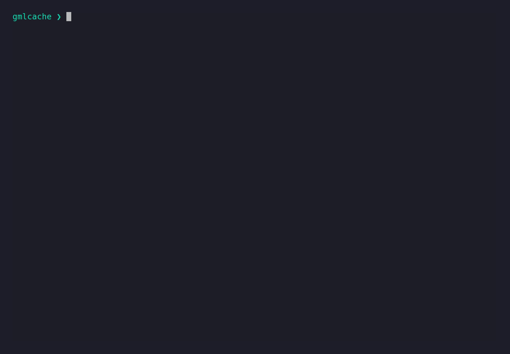

<div align="center">

# CLI Reference

<sub>Reference</sub>

<br>

[Documentation home](../README.md)&nbsp;&nbsp;•&nbsp;&nbsp;[Repository README](../../README.md)

</div>

---

> [!TIP]
> Reference pages are optimized for lookup. Start with the conceptual documents when you need background.

## At a glance

- [Current commands](#current-commands)
- [Current command options](#current-command-options)
- [Future scope/session commands](#future-scopesession-commands)
- [Future async commands](#future-async-commands)
- [Future alias mode](#future-alias-mode)

---

This reference contains the intended command surface. Exact syntax may differ by
release; use `gmlcache --help` for the installed version.

## Current commands

```text
gmlcache run ...
gmlcache check ...
gmlcache list
gmlcache inspect <key-or-prefix>
gmlcache tags
gmlcache export
gmlcache encrypt
gmlcache decrypt
gmlcache rotate
gmlcache invalidate
gmlcache session start
gmlcache session report <id>
gmlcache stats
gmlcache doctor
gmlcache models <client>
gmlcache status
gmlcache init
```

<div align="center">

</div>

## Current command options

The two core commands are `run` (execute or replay a call) and `check` (forecast
cache behavior for a call without running it). `--client` is required on both;
provide a prompt with either `--prompt` or `--prompt-file`.

### `run`

Selection:

| Option | Meaning |
|---|---|
| `--client` | Client to launch: `claude`, `codex`, or `cursor`. Required. |
| `--model` | Model identifier, passed or translated by the adapter. |
| `--effort` | Reasoning effort (optional); omit for the client's default. For Cursor, leave this off when the model id already encodes effort. |

Input:

| Option | Meaning |
|---|---|
| `--prompt` / `--prompt-file` | The prompt, inline or from a file. |
| `--context` / `--context-file` | Context text, inline or from a file. |
| `--system-prompt` / `--system-prompt-file` | System prompt, inline or from a file. |
| `--input-file` | A file the client reads in place; its content is fingerprinted into the key and the client is granted read access. Repeatable, any type. The key watches content, not the name. |
| `--allow-path` | A folder the client may scan/read but whose contents the cache cannot fingerprint. Declaring any allow-path makes the call run fresh and store nothing (non-cacheable). Repeatable. |
| `--tag` | Label this execution for grouping and later queries (`list --tag`, `export --tag`, `tags`). Metadata only — never part of the cache key; relabeling an already-cached input accumulates tags. Repeatable. |

Capability and passthrough:

| Option | Meaning |
|---|---|
| `--grant` | Open a capability for the client: `net`, `read`, `write`, `shell`, or `web-search` — enablement, not restriction. Keyed into the call (a granted call is its own execution) and cacheable; use `--force` for a live re-fetch. Repeatable. See [Grants reference](grants.md). |
| `--client-arg` | An extra argument appended verbatim to the client launch — an escape hatch for client features the cache does not model. Part of the key; only its fingerprint is stored, never the raw value. Repeatable; order is significant. Use the `=` form for dash-leading values: `--client-arg=--flag`. |
| `--executable` | Override the client executable (the seam). |
| `--token` | Encryption token for an encrypted store (or set `GMLCACHE_TOKEN`). Needed to read or record when encryption is on; ignored on a public store. |
| `--session` | Group this run under a session id (or set `GMLCACHE_SESSION`); see [Sessions](#sessions). Journal metadata, never part of the key. |

Mode:

| Option | Meaning |
|---|---|
| `--mode` | Resolution mode: `cache` (default — hit replays, miss records), `offline` (replay only; a miss is an error), or `refresh` (always call and overwrite). Falls back to config/environment. |
| `--offline` | Shortcut for `--mode offline`. |
| `--force` | Shortcut for `--mode refresh`. |
| `--persist` | How much to keep on disk: `meter` (usage/metadata only — every call runs, never replays), `cache` (default — also stores the output and replays on a hit), or `dataset` (also stores the input, to build an exportable `(input, output)` corpus). Falls back to config (`persist`) / environment (`GMLCACHE_PERSIST`). |
| `--record-on-error` | Also cache a call that fails (non-zero exit); the default stores only successes. |

Output and control:

| Option | Meaning |
|---|---|
| `--json` | Emit a machine-readable JSON envelope (status, exit, files, normalized usage, stdout) instead of the raw answer — for a parent process such as the workflow engine reading usage. Files are still written to the cwd. |
| `--stream` | Write a live NDJSON progress stream as the call runs — display-only, it never changes what is recorded. Give a path, or pass `--stream` alone to write `./gmlc-stream.jsonl`. |
| `--timeout` | Seconds before the real call is killed. |
| `-v`, `--verbose` | Print cache diagnostics to stderr (breaks exact fidelity). |

### `check`

`check` forecasts whether a call would hit or miss and what it would cost, without
executing. It accepts the same call-defining options as `run` so the forecast
matches the run you would make: `--client`, `--model`, `--effort`, `--prompt` /
`--prompt-file`, `--context` / `--context-file`, `--input-file`, `--allow-path`,
`--client-arg`, `--grant`, and `--json`. It does not take the execution-only
options (`--mode` / `--offline` / `--force`, `--stream`, `--record-on-error`,
`--executable`, `--timeout`, `--system-prompt`, `--verbose`).

### Other commands

| Command | Options |
|---|---|
| `inspect <key-or-path>` | `--raw` also prints the client's verbatim usage block. Accepts a short key as shown by `list`. Shows whether the entry's input was stored (`dataset` depth). |
| `list` | `--client`, `--model` filter the listing; `--tag` / `--exclude-tag` filter by tag (match-any include / exclude, with exclude winning); `--json` for machine output. |
| `tags` | List the distinct tags in use across current executions, with counts. `--json` for machine output. |
| `export` | Export the `dataset`-depth `(input, output)` corpus as JSONL. `--tag` / `--exclude-tag` filter by tag (match-any; exclude wins); `-o` / `--output FILE` writes to a file instead of stdout (a per-record summary still goes to stderr). Entries stored below `dataset` depth carry no input and are skipped (and reported). On an encrypted store it needs `--token` / `GMLCACHE_TOKEN`. |
| `models <client>` | `--executable` overrides the client executable; `--timeout`; `--json`. Omit `<client>` to query every registered client. |
| `doctor` | `--timeout` (default 10s); `--json`. |
| `stats` | `--json`. |
| `status` | `--json`. Also shows the encryption state (public / encrypted). |
| `init` | (no options) writes a starter config file on explicit request. |

### Encryption

At-rest encryption is **store-wide** and optional. gmlcache generates the token (no outside
passwords); keep it safe — it is shown once and is unrecoverable if lost.

<div align="center">

</div>

| Command | Options |
|---|---|
| `encrypt` | Enable encryption: generate a token, encrypt the store, print the token once. |
| `decrypt` | Disable encryption (decrypt back to plaintext). `--token` / `GMLCACHE_TOKEN`. |
| `rotate` | Swap to a freshly generated token (the content is not re-encrypted). `--token` is the *current* token. |
| `invalidate` | Crypto-shred the store — the escape when the token is lost. Requires `--yes`. |

The token is supplied at runtime via `--token` or `GMLCACHE_TOKEN`, **never the config file**.
Content commands (`run`, `export`) need it on an encrypted store; metadata-only commands
(`list`, `stats`, `tags`, `status`) do not. Encryption covers the content (prompts, outputs,
inputs); execution metadata stays plaintext — see the
[data-handling note](../design/data-handling.md).

### Sessions

A session groups one workflow's runs so they can be reported together. Sessions are
single-user and need only a generated id — no token.

| Command | Options |
|---|---|
| `session start` | Generate a new session id and print it (scriptable: `SESSION=$(gmlcache session start)`). |
| `session report <id>` | Roll up the session's journal — invocations, executions (real calls), hits (served from cache), and the per-event breakdown. `--json` for machine output. |

Attach a run to a session with `run --session <id>` or `GMLCACHE_SESSION`. The session id is
journal metadata, never part of the cache key, and sessions span every run kind. Reporting is
metadata-only, so it works on an encrypted store without the token.

## Future session commands

```text
gmlcache session watch <session-id>
```

`session watch` (a live tail of a running session) is not yet built; `session start` and
`session report` have shipped — see [Sessions](#sessions) above.

## Future async commands

```text
gmlcache run --detach ...
gmlcache execution status <execution-id>
gmlcache execution watch <execution-id>
gmlcache execution result <execution-id>
gmlcache execution materialize <execution-id> --output-dir <path>
```

## Future alias mode

```text
gmlcache alias <adapter> <native adapter arguments...>
```

Everything after `<adapter>` is native adapter input and is included in cache
identity as an opaque tail.

---

<div align="center">

<sub>[Documentation home](../README.md)&nbsp;&nbsp;•&nbsp;&nbsp;[Repository README](../../README.md)</sub>

</div>
